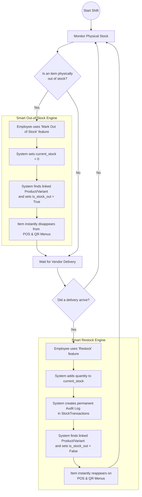

# Inventory Management System & Employee Workflow

This document outlines the complete feature set of the new Inventory Management application and provides a visual flowchart demonstrating exactly how an outlet employee interacts with the system on a daily basis.

---

## 🌟 Core Features
1. **Supplier Directory**: Manage vendors and their contact details for each specific outlet.
2. **Stock Tracking & Linkage**: Track inventory quantities in various units (kg, liters, pcs). Items intelligently link directly to the sellable POS `Products` or `ProductVariants`.
3. **Audit Ledger (Stock Transactions)**: An append-only ledger that records every stock movement (Restocks, Damages, Adjustments) along with timestamps and notes.
4. **Smart Out-of-Stock Engine**: A specialized API where marking an item "Empty" automatically propagates the `is_stock_out` flag to the POS menus.
5. **Smart Restock Engine**: A specialized API where logging a delivery automatically removes the `is_stock_out` flag, immediately making the item sellable again.

---

## 🔄 Employee Workflow Flowchart

Below is the standard operating procedure for an outlet employee managing physical inventory and ensuring the digital POS menus stay perfectly synced.

---

## 👤 Step-by-Step Employee Actions

Here is how the employee will practically use the application throughout the day:

### 1. Daily Setup (Managers / Admins)
When a new product or ingredient is introduced to the outlet, the manager will:
1. Add the supplier to the **Supplier Directory**.
2. Create an **Inventory Item**, specifying the unit of measurement (e.g., Kilogram).
3. Optionally link this inventory item to an existing sellable **Product** or **Variant** on the POS menu.

### 2. Handling Empty Stock (Cashier / POS Employee)
When the kitchen informs the cashier that they have run out of "Tomato Soup":
1. The employee opens the Inventory Management interface.
2. They select "Tomato Soup" and hit the **Mark Out of Stock** button.
3. *They are done.* The system automatically ensures no customer can order it from the QR code menu or the POS interface.

### 3. Handling Deliveries (Cashier / Store Admin)
When the delivery truck arrives with fresh ingredients:
1. The employee opens the Inventory Management interface and clicks **Restock**.
2. They select the items delivered (e.g., "Tomato Soup", "Cheese"), enter the quantity received, and optionally select the Supplier.
3. *They are done.* The system automatically updates the stock counts, saves the audit trail for the manager to see, and instantly reactivates the items on the POS and QR menus so customers can resume ordering them.
